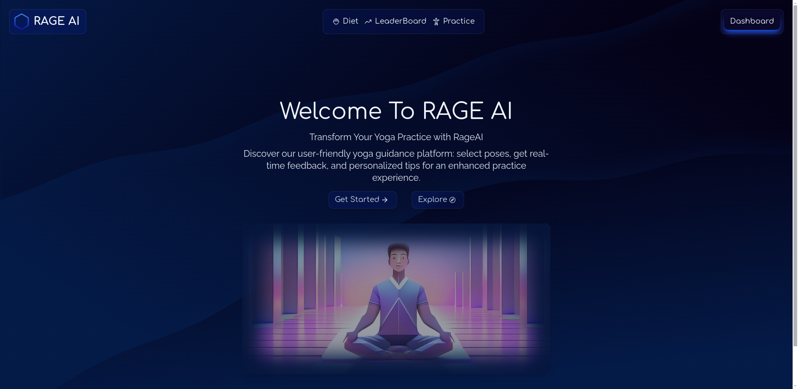
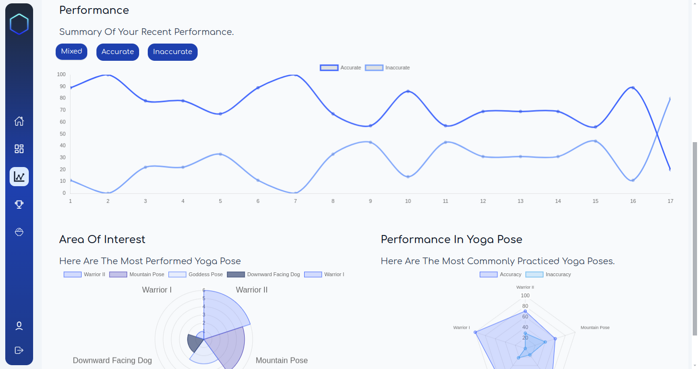
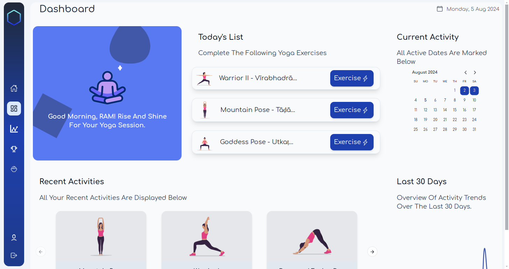
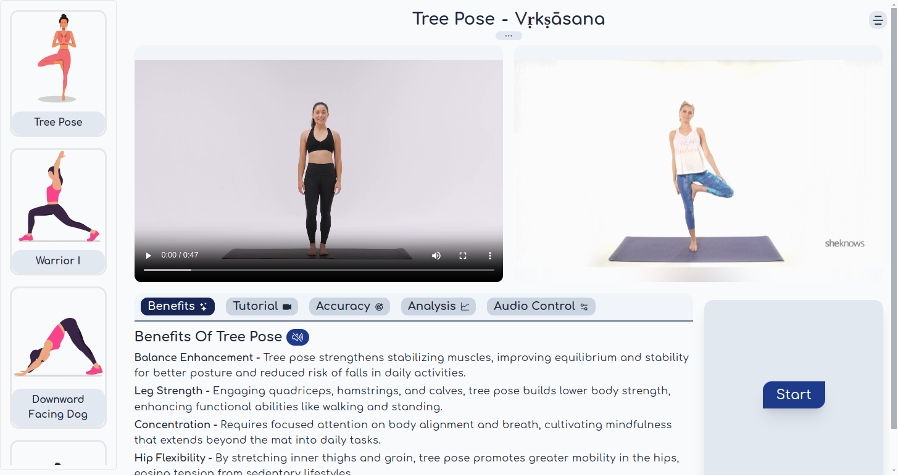

                         
<br/>
<div align="center">
<a href="http://yoga-trainer-v2.vercel.app/">

</a>
<h3 align="center">RAGE AI</h3>
<p align="center">
Find your center with RAGE AI: Your AI-Powered Yoga Partner!
<br/>
<br/>
<a href="https://rage-AI.vercel.app/">
<strong>Explore the platform for learning yoga »</strong></a>
<br/>
<br/>


</p>
<h3 align="center">This project is currently in the development stage.</h3>
<br/>
</div>


 ## About The Project




**Welcome** to my project! I'am developed a platform using **TensorFlow** and **Keras** for **deep learning-based yoga guidance**. Users select a pose, perform it while their webcam feed sends images to our **CNN model** for **real-time** feedback. Our narrator provides tips, enhancing the experience. Built with Next.js, Tailwind CSS, and TensorFlow.js, it's user-friendly and continuously evolving with an expanding selection of poses."

- Seamlessly **select and perform** yoga poses
- Receive **real-time feedback** on pose accuracy
- Benefit from helpful tips and insights from our **narrator**
- Utilize our **intuitive interface** and seamless integration for a smooth user experience
- Currently f**eaturing seven available poses** in our trained model, with plans for expansion
- Experience the future of **yoga guidance** with our innovative platform. 

Join us as we strive to promote mindfulness, well-being, and self-improvement through the power of technology.




  ### Built With
- [Next](https://nextjs.org)
- [Tailwind CSS](https://tailwindcss.com)
- [Typescript](https://www.typescriptlang.org)
- [Python](https://www.python.org)
- [Tensorflow](https://www.tensorflow.org)
- [Keras](https://keras.io)
- [Vercel](https://vercel.com)
- [Kaggle](https://kaggle.com/)

 ## Getting Started
To begin using our yoga trainer, follow these simple steps:
 ### Prerequisites

Ensure that you have Yarn installed (optional).
You can alternatively use npm as well.
- yarn
  ```
  npm install --global yarn
  ```
 ### Installation

Ensure you have **yarn** installed on your system. If not, you can also utilize **npm**.

Once Yarn is installed, navigate to the project directory and run the following command to install dependencies:

1. Clone the Repo
   ```sh
   git clone https://github.com/rajyavardhanbithale/yoga-trainer

   ```
2. Change Directory
   ```
   cd yoga-trainer
   ```
3. Install Dependencies
   1. Using yarn
      ```sh
      yarn
      ```
   
   2. Using npm
      ```
      npm install
      ```
 ## Usage

After installing the dependencies, you can start the development server by running:

1. Development Server
   1. Using yarn
      ```sh
      yarn dev
      ```
   
   2. Using npm
      ```
      npm run dev
      ```

 ## Roadmap

- [x] Make prediction faster
- [ ] Add more yoga poses to model
- [ ] Add Responsive Layout for smaller device
- [ ] Improve UI/UX 
- [ ] Multi-language Support
  - [ ] Hindi
  - [ ] Spanish

## LICENSE

<p xmlns:cc="http://creativecommons.org/ns#" xmlns:dct="http://purl.org/dc/terms/"><a property="dct:title" rel="cc:attributionURL" href="https://github.com/rajyavardhanbithale/yoga-trainer">RAGE AI</a> by <a rel="cc:attributionURL dct:creator" property="cc:attributionName" href="https://github.com/rajyavardhanbithale">Rajyavardhan Bithale</a> is licensed under <a href="https://creativecommons.org/licenses/by-nc-sa/4.0/?ref=chooser-v1" target="_blank" rel="license noopener noreferrer" style="display:inline-block;">CC BY-NC-SA 4.0</a></p>

 ## Contributing

Contributions are what make the open source community such an amazing place to learn, inspire, and create. Any contributions you make are **greatly appreciated**.

If you have a suggestion that would make this better, please fork the repo and create a pull request. You can also simply open an issue with the tag "enhancement".
Don't forget to give the project a star! Thanks again!


 ## Reach out me at
<a href="https://www.linkedin.com/in/rajyavardhan-bithale-999482258/" target="_blank">
  
</a>
<a href="https://github.com/rajyavardhanbithale/" target="_blank">
  
</a>

<a href="mailto:bithale02@gmail.com" target="_blank">
  
</a>


## Thanks
At last, I would like to express my gratitude to Vercel for hosting and providing wonderful cloud services.

[](https://vercel.com)
